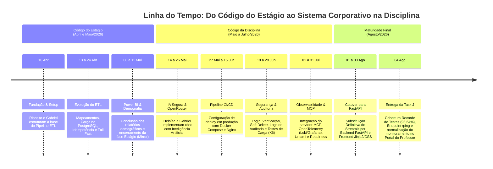

# 📜 Registro de Evolução e Histórico Completo do Projeto EQ10

Este documento constitui o registro oficial do histórico de **todos os commits** e mudanças realizadas na base de código desde a sua fundação. O desenvolvimento do projeto divide-se estruturalmente em duas grandes etapas: a criação inicial durante o estágio supervisionado e a posterior expansão, segurança, observabilidade e migração arquitetural durante a disciplina de Desenvolvimento de Sistemas Corporativos.

---

## 🏢 1. Código gerado durante o estágio

> [!NOTE]
> **Histórico de Autoria e Espelheamento (Mirror):**
> Nesta primeira fase, o repositório conta com commits exclusivos dos autores **Riansito** e **Gabriel Nunes**. Os commits de Riansito aparecem neste registro histórico porque o repositório utilizado na disciplina **é um Mirror (espelho) exato do código construído no estágio supervisionado** até aquele momento. Por essa razão, todo o histórico Git de commits original do Riansito veio junto e foi devidamente preservado na base da disciplina.

### 📌 1.1 Estruturação Inicial e Setup Básico

| Commit | Data | Autor | Resumo da Alteração |
| :---: | :---: | :--- | :--- |
| **`ed2a2b3`** | 2026-04-10 | Riansito | first commit |
| **`9cbfdd7`** | 2026-04-10 | Riansito | feat: Adiciando Arquivos de configuração |
| **`63b2b91`** | 2026-04-10 | Riansito | feat: adicionando arquivos iniciais do ETL |
| **`8a05d13`** | 2026-04-10 | Gabriel Nunes | Criando dicionários |
| **`bc5eef7`** | 2026-04-10 | Gabriel Nunes | Organização do notebook |
| **`03bc90a`** | 2026-04-10 | Gabriel Nunes | Adicionado Dicionário para renomear Municípios |
| **`c354d26`** | 2026-04-10 | Riansito | feat: adicionando a função de extract |
| **`72fbf06`** | 2026-04-10 | Riansito | feat: Adicionando a função de remover colunas desnecessárias |
| **`e22f858`** | 2026-04-10 | Gabriel Nunes | Criada classe dic.py |
| **`a5f9c48`** | 2026-04-10 | Gabriel Nunes | testando transform_rename_columns |

### 📌 1.2 Evolução do Pipeline ETL (Extract, Transform, Load)

| Commit | Data | Autor | Resumo da Alteração |
| :---: | :---: | :--- | :--- |
| **`cd6661d`** | 2026-04-13 | Gabriel Nunes | dicionário |
| **`9ccb6b0`** | 2026-04-13 | Riansito | chore: organiza notebook criando área para testes de transformações |
| **`a569831`** | 2026-04-13 | Riansito | test: valida comportamento da função de destaque de filtros no ipynb |
| **`3f44263`** | 2026-04-13 | Riansito | chore: atualiza .gitignore ignorando ambiente virtual e dados locais |
| **`390dc93`** | 2026-04-13 | Riansito | chore: adiciona .env ao gitignore e cria arquivo .env.example |
| **`3a5c6d0`** | 2026-04-13 | Riansito | chore: remove .env do versionamento e atualiza gitignore |
| **`85ab6e3`** | 2026-04-13 | Riansito | chore: remove .env do versionamento e atualiza gitignore |
| **`52b19c6`** | 2026-04-13 | Gabriel Nunes | criada e testada def transform_filter_units |
| **`3b4bfbd`** | 2026-04-13 | Gabriel Nunes | Correção no nome dos df 's em testes Adição das unidades de bananeiras na lista 'list_units' |
| **`b688d1f`** | 2026-04-13 | Gabriel Nunes | Adição das unidades de Queimadas |
| **`25402c8`** | 2026-04-13 | Riansito | refactor: ajusta nomes das colunas nos filtros para usar padrão definido após renomeação |
| **`75799f6`** | 2026-04-13 | Riansito | feat: adicionando o transform no etl |
| **`5a7c25d`** | 2026-04-13 | Riansito | docs: adiciona comentários explicativos nas funções de transformação |
| **`c2867c5`** | 2026-04-13 | Riansito | docs: adiciona comentários explicativos nas funções de extrair |
| **`3748ce1`** | 2026-04-14 | Riansito | refactor: extrair listas de filtro e mapeamentos de colunas para constants |
| **`5f6e710`** | 2026-04-14 | Riansito | chore: adiciona dicionário de apoio no notebook de testes |
| **`e990f12`** | 2026-04-14 | Gabriel Nunes | feat: adicionando arquivo tratado na pasta de dados como arquivo parquet |
| **`b048ccf`** | 2026-04-14 | Gabriel Nunes | feat: Adicionando arquivo transformado na pasta data |
| **`5a5cffc`** | 2026-04-14 | Gabriel Nunes | feat: Adcionando a funcionalidade load e integração com postgres |
| **`6124b66`** | 2026-04-16 | Gabriel Nunes | feat: carregando dim_ocupacao.parquet e dim_procedimentos.parquet no banco de dados |
| **`99f52fd`** | 2026-04-16 | Riansito | refactor: melhorando a logica de realização da extração dos dados |
| **`2c4c138`** | 2026-04-16 | Riansito | chore: adicionando comentarios no codigo de extrair dados |
| **`e8447dc`** | 2026-04-17 | Gabriel Nunes | feat: adiciona carga das dimensões de raça/cor e município ao pipeline de ETL |
| **`2c27332`** | 2026-04-17 | Riansito | refactor: Atualizando o banco de dados |
| **`375c3df`** | 2026-04-17 | Gabriel Nunes | refactor: Trocado link de acesso ao banco de dados, garantindo segurança dos dados de acesso |

### 📌 1.3 Idempotência, Fail Fast e Experimentos com Airflow e Docker

| Commit | Data | Autor | Resumo da Alteração |
| :---: | :---: | :--- | :--- |
| **`593ef4f`** | 2026-04-22 | Gabriel Nunes | feat: setup airflow e docker |
| **`b90eba0`** | 2026-04-22 | Gabriel Nunes | feat: dag datasus criada |
| **`217e82b`** | 2026-04-22 | Riansito | feat: adicionando arquivos do docker |
| **`0a6afa9`** | 2026-04-23 | Riansito | refactor: mudando algumas coisas |
| **`0e6353f`** | 2026-04-24 | Gabriel Nunes | Apagando dados relacionados ao Airflow. deleted:    Dockerfile deleted:    dags/datasus.py deleted:    docker-compose.yaml deleted:    requirements-airflow.txt |
| **`7a879aa`** | 2026-04-24 | Riansito | fix: corrigindo erros das colunas incompatíveis com a do banco |
| **`f42a9da`** | 2026-04-24 | Riansito | chore: adicionando os logs para o acompnhamento dos tranforms |
| **`20492bf`** | 2026-04-24 | Riansito | chore: adicionando logs no extract para o cacompnhamento da extração |
| **`8bce8c8`** | 2026-04-24 | Riansito | chore: adicionando logs no extract e na main para finalizar todo o acompanhamento do pipeline |
| **`b565f31`** | 2026-04-24 | Gabriel Nunes | feat(etl): implementa idempotência (rodar o script várias vezes sem duplicar dados) e fail fast (parar a execução no primeiro milissegundo caso o dado já exista) na extração do SIA |

### 📌 1.4 Painéis Power BI, Demografia e Filtros Regionais

| Commit | Data | Autor | Resumo da Alteração |
| :---: | :---: | :--- | :--- |
| **`69c91a6`** | 2026-05-06 | Riansito | docs: adicionando a pasta do power bi |
| **`1a0358b`** | 2026-05-06 | Riansito | fix: consertando um grafico errado no power bi |
| **`1cbec7b`** | 2026-05-08 | Riansito | feat: adicionando filtros da cidade de residencias dos pacientes |
| **`61f5533`** | 2026-05-08 | Gabriel Nunes | feat: iniciado a página de demografia Adicionado gráfico de frequenia por raca_cor Adicionado gráfico de sexo dos pacientes |
| **`e5764a4`** | 2026-05-08 | Gabriel Nunes | fix: gráficos atualizados |
| **`3670b89`** | 2026-05-08 | Riansito | refactor: remodelando a tela de demografia |
| **`be1a027`** | 2026-05-08 | Riansito | refactor: adicionando novo fundo da tela de demografia |
| **`95d5b76`** | 2026-05-08 | Riansito | feat: adicionando tabela de frequencia por faixa etária de idade |
| **`bda4098`** | 2026-05-08 | Riansito | refsctor: deixando todas as paginas com filtro em Mamaguape |
| **`256dede`** | 2026-05-08 | Riansito | refactor: ajustando erros ortográficos nos titulos dos gráficos |
| **`6f02991`** | 2026-05-08 | Riansito | feat: adicionando coloração de fonte condicional para a coluna de variação de procedimentos na pagina de análise anual |
| **`53040ba`** | 2026-05-11 | Riansito | feat: adicionando mais uma coluna para ser enviada com os dados, a coluna "PA_SEXO" |
| **`a8b22f6`** | 2026-05-11 | Riansito | refactor: retirando o simbolo monetário dos cards de frequencia de valor apresentado |

---

## 🎓 2. Código gerado durante a disciplina

> [!IMPORTANT]
> **Autoria na Disciplina:**
> A partir desta fase (meados de Maio de 2026 em diante), inicia-se o desenvolvimento voltado exclusivamente às exigências da disciplina de **Desenvolvimento de Sistemas Corporativos**, sob mentoria e avaliação do professor. Os commits do projeto, implementações arquiteturais e refatorações são de autoria exclusiva da dupla de alunos **Gabriel Nunes** e **Heloísa Duarte** (acompanhados pontualmente por commits de documentação, templates de avaliação e configuração de runners de autoria do **Prof. Rodrigo Rebouças**).

### 📌 2.1 Camada Segura de Inteligência Artificial, Chatbot e OpenRouter

| Commit | Data | Autor | Resumo da Alteração |
| :---: | :---: | :--- | :--- |
| **`6b77dc9`** | 2026-05-14 | Heloísa Duarte | feat: documentação técnica e configurações do docker |
| **`37e889f`** | 2026-05-20 | Heloísa Duarte | feat: adiciona camada segura de análise com IA |
| **`3052581`** | 2026-05-26 | Heloísa Duarte | feat: interface inicial do chat |
| **`2a84983`** | 2026-05-26 | Gabriel Nunes | fix: correção de bugs de segurança, estabilidade e diretórios |
| **`22e41eb`** | 2026-05-26 | Gabriel Nunes | fix: reslvendo conflito entre a versão do pandasai com o python utilizado |
| **`b1bb4b2`** | 2026-05-26 | Heloísa Duarte | fix: improve safe AI diagnostics |
| **`581553c`** | 2026-05-26 | Heloísa Duarte | feat:  integração OpenRouter AI chat ;( |

### 📌 2.2 Pipeline CI/CD, Nginx e Docker Compose de Produção

| Commit | Data | Autor | Resumo da Alteração |
| :---: | :---: | :--- | :--- |
| **`242fa38`** | 2026-05-27 | Gabriel Nunes | fix:  consertado erro invisível de falta do driver psycopg nos bastidores, e retornasse essa mensagem genérica na tela sem te mostrar o erro real no terminal |
| **`6f73482`** | 2026-05-27 | Gabriel Nunes | feat: criados arquivos para testar a pipeline da IA para o pandas AI |
| **`848b37b`** | 2026-05-27 | Heloísa Duarte | refactor: docker reconfigurado |
| **`314837c`** | 2026-05-27 | Heloísa Duarte | Merge branch 'main' of https://github.com/Gabriel-Nunes-UFPB/DSC_SEC-MME |
| **`e43732c`** | 2026-05-27 | Gabriel Nunes | refactor: limite de linhas lidas aumentado |
| **`bd1ce19`** | 2026-05-27 | Gabriel Nunes | ops: adicionado deploy.yml |
| **`c7fda50`** | 2026-05-27 | Gabriel Nunes | ci: configura docker compose e github actions para deploy em producao |
| **`c329dc3`** | 2026-05-27 | Gabriel Nunes | ci: remove scp-action e cria compose no ssh para evitar erro de permissao |
| **`1130d86`** | 2026-05-27 | Gabriel Nunes | ci: hardcode image name in docker-compose.prod.yml to avoid server .env conflicts |
| **`a1f342f`** | 2026-05-27 | Gabriel Nunes | ci: force github actions template evaluation to bypass server bashrc |
| **`77e3d10`** | 2026-05-27 | Gabriel Nunes | ci: deploy in isolated directory to prevent old docker-compose override files from interfering |
| **`d7137b1`** | 2026-05-27 | Gabriel Nunes | ci: override global COMPOSE_FILE to bypass professor template |
| **`83aad59`** | 2026-05-27 | Gabriel Nunes | ci: force clean environment in home directory |
| **`39a06bd`** | 2026-05-27 | Heloísa Duarte | ci: add deployment workflow |
| **`62efc48`** | 2026-05-27 | Heloísa Duarte | ci: configure chat deployment |
| **`858a762`** | 2026-05-27 | Heloísa Duarte | ci: configure chat deployment |
| **`f570a29`** | 2026-05-27 | Heloísa Duarte | ci: fix deploy image output |
| **`3593c5e`** | 2026-05-27 | Heloísa Duarte | test: validate deploy workflow |
| **`8e8165a`** | 2026-05-27 | Heloísa Duarte | ci: fix deploy workflow yaml syntax |
| **`e26dcb9`** | 2026-05-27 | Heloísa Duarte | ci: use fixed GHCR image name |
| **`1dad0aa`** | 2026-05-27 | Heloísa Duarte | ci: use fixed image directly in deploy |
| **`11ee4de`** | 2026-05-27 | Heloísa Duarte | ci: add deploy diagnostics |
| **`063251f`** | 2026-05-28 | Heloísa Duarte | ci: isolate deploy diagnostics |
| **`45d0699`** | 2026-05-28 | Heloísa Duarte | ci: pass image variable to deploy |
| **`65891e2`** | 2026-06-03 | Gabriel Nunes | feat: implement CI/CD deployment pipeline and update application port to 8080 |
| **`51c4627`** | 2026-06-03 | Gabriel Nunes | feat: add early exit to pipeline if no new data is extracted |
| **`a7d0886`** | 2026-06-03 | Gabriel Nunes | configurando rota ping nginx |
| **`fbccded`** | 2026-06-03 | Gabriel Nunes | fix(docker): resolver crlf no start.sh para servidor linux |
| **`5653de2`** | 2026-06-03 | Gabriel Nunes | fix(ci): apontar build para Dockerfile.chat |

### 📌 2.3 Autenticação, Gestão de Usuários, Verificação de E-mail e Soft Delete

| Commit | Data | Autor | Resumo da Alteração |
| :---: | :---: | :--- | :--- |
| **`b42fedc`** | 2026-06-19 | Heloísa Duarte | Use vw_data_sus_ia in AI layer |
| **`e3c4e18`** | 2026-06-19 | Heloísa Duarte | fix: Melhora interface do chat e tratamento das sugestões |
| **`9efd678`** | 2026-06-21 | Heloísa Duarte | Estabiliza autenticação e organiza interface do app |
| **`b3699c3`** | 2026-06-21 | Heloísa Duarte | feat: Implementa soft delete de usuários |
| **`72ce4a2`** | 2026-06-21 | Heloísa Duarte | fix: Ajusta ações do perfil como cards clicáveis |
| **`ec8e72a`** | 2026-06-21 | Heloísa Duarte | fix: correção do fluxo de ações do perfil |
| **`207da86`** | 2026-06-21 | Heloísa Duarte | Melhora confiabilidade do Chat IA |
| **`54fd2d6`** | 2026-06-21 | Heloísa Duarte | feat: Implementa base de verificação de e-mail |
| **`926822c`** | 2026-06-21 | Heloísa Duarte | Implementa base de recuperação de senha e Adiciona checklist e handler de verificação por token |
| **`2963dc2`** | 2026-06-21 | Heloísa Duarte | feat: Implementa histórico e auditoria do Chat IA |
| **`c20f100`** | 2026-06-21 | Heloísa Duarte | feat: Adiciona diagnósticos internos seguros |
| **`7a76d99`** | 2026-06-22 | Heloísa Duarte | Ajustes na verificação de emails(incompleto) |
| **`8c09f0a`** | 2026-06-22 | Heloísa Duarte | continuando na verificação de email e mais alguns ajustes |
| **`66c4961`** | 2026-06-22 | Heloísa Duarte | Mudanças no fluxo de alterar email |
| **`2440130`** | 2026-06-24 | Gabriel Nunes | feat: criados testes para verificar a lista de modelos disponíveis para a api e para receber um status de resposta da ia |
| **`e9961f9`** | 2026-06-24 | Gabriel Nunes | update: gitignore modificado para ignorar a pasta testing_ai |
| **`ac56f03`** | 2026-06-24 | Gabriel Nunes | update: gitignore agora não deixa o pycache ir para as commits |
| **`8a358d8`** | 2026-06-24 | Gabriel Nunes | update .gitignore to ignore __pycache__ directories |
| **`35e86e2`** | 2026-06-24 | Gabriel Nunes | Merge pull request #2 from Des-Sist-Corp-UFPB/feature/update-ai-views |
| **`81bbc57`** | 2026-06-24 | Gabriel Nunes | feat: log de auditoria |
| **`2eae951`** | 2026-06-24 | Gabriel Nunes | Merge branch 'feature/update-ai-views' |
| **`1b9e723`** | 2026-06-25 | Prof. Rodrigo Rebouças | docs: relatório de avaliação 2026-06-25 |
| **`c31243f`** | 2026-06-25 | Prof. Rodrigo Rebouças | docs: atualiza relatório com dados GitHub API (divergências de autoria) |
| **`900b63d`** | 2026-06-25 | Prof. Rodrigo Rebouças | chore: atualiza relatório (nomes e comparação API GitHub) |
| **`a5cf5d0`** | 2026-06-26 | Prof. Rodrigo Rebouças | docs: guia de contribuição Git para avaliação |
| **`0e645ff`** | 2026-06-28 | Heloísa Duarte | feat: adiciona autenticação com google(incompleto) |
| **`41d24d5`** | 2026-06-28 | Heloísa Duarte | Merge branch 'main' into feature/autenticacao-google |
| **`0edb44b`** | 2026-06-28 | Heloísa Duarte | Merge pull request #3 from Des-Sist-Corp-UFPB/feature/autenticacao-google |

### 📌 2.4 Logs de Auditoria, Estilização da UI e Cobertura de Testes de Carga (K6)

| Commit | Data | Autor | Resumo da Alteração |
| :---: | :---: | :--- | :--- |
| **`c96be46`** | 2026-06-29 | Prof. Rodrigo Rebouças | docs: orientações para avaliação final (prazo 30/06) |
| **`33c3236`** | 2026-06-29 | Heloísa Duarte | fix: Ajustes de bugs da aba dos logs de auditoria |
| **`818b9e7`** | 2026-06-29 | Heloísa Duarte | Merge branch 'main' of https://github.com/Des-Sist-Corp-UFPB/projeto-eq10 |
| **`324e7eb`** | 2026-06-29 | Heloísa Duarte | ci: add retry no workflow de deploy |
| **`2c4d4c2`** | 2026-06-29 | Heloísa Duarte | test: adiciona testes de cobertura e executor alternativo de cobertura |
| **`b14eeb0`** | 2026-06-29 | Heloísa Duarte | fix: correção da estilização do sidebar e dos botões de "meu perfi"l e "sair" |
| **`fb636af`** | 2026-06-29 | Heloísa Duarte | fix: mais ajuster de estilização |
| **`a2fb827`** | 2026-06-29 | Heloísa Duarte | ajustes não funcionaram muito bem em produção, testando de novo |
| **`4a5a177`** | 2026-06-29 | Heloísa Duarte | testando estilização em produção de novo |
| **`c04c46b`** | 2026-06-30 | Heloísa Duarte | docs: document audit integrations and coverage |
| **`2fa995c`** | 2026-06-30 | Heloísa Duarte | fix: melhora o logo fallback e estilização |
| **`225b9aa`** | 2026-06-30 | Heloísa Duarte | fix: adiciona tentativas de reconexão ao banco de dados |
| **`b7d0744`** | 2026-06-30 | Heloísa Duarte | fix: ajustar botões da tabela de auditoria |
| **`74bd5a5`** | 2026-06-30 | Heloísa Duarte | fix: corrige logo em produção e toolbar da tabela de auditoria |
| **`9d180ee`** | 2026-07-01 | Prof. Rodrigo Rebouças | docs: avaliação automática preliminar (2026-07-01) |
| **`37980ca`** | 2026-07-01 | Prof. Rodrigo Rebouças | test: template de teste de carga/performance (k6) local |
| **`065dab5`** | 2026-07-01 | Prof. Rodrigo Rebouças | docs: ideia de servidor MCP para integração de LLMs |
| **`abb1d6e`** | 2026-07-01 | Prof. Rodrigo Rebouças | docs: cobertura avaliada por LINHAS (mostra instruções/ramos) |
| **`1d55591`** | 2026-07-01 | Prof. Rodrigo Rebouças | docs: adiciona tutorial introdutório sobre servidores MCP |
| **`06d7e22`** | 2026-07-01 | Heloísa Duarte | test: adiciona testes de carga para interfaces e serviços |
| **`7bcab81`** | 2026-07-01 | Heloísa Duarte | Merge branch 'main' of https://github.com/Des-Sist-Corp-UFPB/projeto-eq10 |

### 📌 2.5 Integração com Servidor MCP (Model Context Protocol) e Runners do GitHub Actions

| Commit | Data | Autor | Resumo da Alteração |
| :---: | :---: | :--- | :--- |
| **`ffe2f2f`** | 2026-07-15 | Prof. Rodrigo Rebouças | ci: usa runner self-hosted da disciplina (dsc-selfhosted) |
| **`8114d6e`** | 2026-07-15 | Gabriel Nunes | feat: add health check functionality and MCP server integration for SIA/DATASUS |
| **`e2e7ef4`** | 2026-07-15 | Gabriel Nunes | Merge branch 'main' of https://github.com/Des-Sist-Corp-UFPB/projeto-eq10 |
| **`5fe5a7c`** | 2026-07-15 | Gabriel Nunes | fix(ci): add setup-buildx-action before build-push to fix Docker daemon error |
| **`2b9ba32`** | 2026-07-15 | Gabriel Nunes | fix(docker): reduce disk usage - add requirements.txt, prune before build, clean pycache |
| **`e774d51`** | 2026-07-15 | Gabriel Nunes | fix(ci): switch to ubuntu-latest runner - self-hosted has no Docker daemon |
| **`192eb4d`** | 2026-07-15 | Prof. Rodrigo Rebouças | ci: volta ao runner self-hosted (dsc-selfhosted) - repo privado, disco do runner resolvido |
| **`ad17549`** | 2026-07-15 | Gabriel Nunes | fix(ci): change runner to self-hosted for build and deploy job |
| **`87f2a60`** | 2026-07-15 | Prof. Rodrigo Rebouças | ci: usa runner do GitHub (ubuntu-latest) em repo publico |
| **`c30426e`** | 2026-07-15 | Gabriel Nunes | feat: add AI_DB_SSLMODE and AI_LLM_BASE_URL; configure professor DB and LLM proxy |
| **`7519870`** | 2026-07-15 | Gabriel Nunes | Merge branch 'main' of https://github.com/Des-Sist-Corp-UFPB/projeto-eq10 |
| **`712501e`** | 2026-07-15 | Gabriel Nunes | fix: change runner to ubuntu-latest for build and deploy job |
| **`da04a4e`** | 2026-07-15 | Gabriel Nunes | fix: restore ETL env vars, fix AI_LLM_BASE_URL /v1, make load.py respect AI_DB_SSLMODE |
| **`bfef713`** | 2026-07-15 | Gabriel Nunes | fix: add local postgres for dev and ETL service in prod compose (ETL needs Docker network) |
| **`9bcdb62`** | 2026-07-15 | Gabriel Nunes | fix: set host=postgres in .env and limit pool_size=5 in load.py (hikari.maximum-pool-size=5) |
| **`b6e7d7a`** | 2026-07-15 | Gabriel Nunes | chore: add .env.prod to gitignore |

### 📌 2.6 Observabilidade com OpenTelemetry, Umami Analytics e Readiness Probes

| Commit | Data | Autor | Resumo da Alteração |
| :---: | :---: | :--- | :--- |
| **`6076ede`** | 2026-07-22 | Prof. Rodrigo Rebouças | docs: guia de OpenTelemetry (telemetria + tutorial de instrumentação) |
| **`8f607d6`** | 2026-07-22 | Prof. Rodrigo Rebouças | docs: guia de logs com OpenTelemetry (Loki) |
| **`e144d3b`** | 2026-07-22 | Heloísa Duarte | testando banco |
| **`21ad4eb`** | 2026-07-22 | Heloísa Duarte | fix: validate Streamlit health after deploy |
| **`8719ce8`** | 2026-07-23 | Heloísa Duarte | Change runner to ubuntu-latest teste |
| **`08844d2`** | 2026-07-23 | Heloísa Duarte | fix: improve post-deploy health diagnostics |
| **`9d11929`** | 2026-07-23 | Heloísa Duarte | Merge branch 'main' of https://github.com/Des-Sist-Corp-UFPB/projeto-eq10 |
| **`6550f25`** | 2026-07-25 | Gabriel Nunes | feat: add new statistics functions and update Dockerfile for Streamlit config |
| **`f96bf6e`** | 2026-07-27 | Heloísa Duarte | fix: centralize AI prompt classification and error handling |
| **`0bbcbb5`** | 2026-07-27 | Heloísa Duarte | fix: restore readonly Neon access through pooler |
| **`2477251`** | 2026-07-29 | Heloísa Duarte | feat: add OpenTelemetry observability with Grafana |
| **`c366915`** | 2026-07-29 | Heloísa Duarte | fix: configure OpenTelemetry for production deploy |
| **`a6ba338`** | 2026-07-29 | Heloísa Duarte | fix: improve telemetry diagnostics and database health checks |
| **`08a8567`** | 2026-07-29 | Heloísa Duarte | docs: finalize OpenTelemetry and health check documentation |
| **`603674e`** | 2026-07-29 | Heloísa Duarte | feat: add privacy-safe Umami analytics |
| **`60f7a48`** | 2026-07-29 | Heloísa Duarte | fix: send Umami page views correctly |
| **`ba0f961`** | 2026-07-29 | Heloísa Duarte | fix: correct analytical health status semantics |
| **`06ebc32`** | 2026-07-29 | Heloísa Duarte | fix: correct readonly verification in analytical health check |
| **`23726ca`** | 2026-07-30 | Heloísa Duarte | feat: add database-aware readiness endpoint |
| **`f70a4ff`** | 2026-07-31 | Heloísa Duarte | fix: make readiness startup resilient |
| **`cc21089`** | 2026-07-31 | Heloísa Duarte | fix: use PID files in container startup smoke test |

### 📌 2.7 Grande Migração para Arquitetura Backend/Frontend (FastAPI + Jinja2)

| Commit | Data | Autor | Resumo da Alteração |
| :---: | :---: | :--- | :--- |
| **`fcabd61`** | 2026-08-01 | Gabriel Nunes | feat: add sidebar and profile menu functionality, create statistics page |
| **`37b6d0b`** | 2026-08-01 | Gabriel Nunes | Add new styles and templates for auditoria, chat, and user management features |
| **`cd28808`** | 2026-08-02 | Gabriel Nunes | fix: repair login 500 risk, add FastAPI Docker deployment layer |
| **`3ccf700`** | 2026-08-02 | Gabriel Nunes | fix: add advisory lock for password reset tokens table creation and update nginx config for Host header |
| **`7e1181a`** | 2026-08-03 | Gabriel Nunes | feat: prep CI/CD cutover to FastAPI (not merged to main yet) |
| **`e729ce6`** | 2026-08-03 | Gabriel Nunes | feat: replace Streamlit with FastAPI at eq10.dsc.rodrigor.com |

### 📌 2.8 Entrega Final da Task J, Cobertura de Testes (93.64%) e Estabilidade de Liveness Probes (/ping)

| Commit | Data | Autor | Resumo da Alteração |
| :---: | :---: | :--- | :--- |
| **`fe62f65`** | 2026-08-04 | Gabriel Nunes | feat: Task J — OpenTelemetry, Umami, /health endpoint, test coverage 93.64%, README evaluation sections |
| **`5837a4b`** | 2026-08-04 | Gabriel Nunes | fix: HEALTHCHECK target /estatisticas (no DB, fast) instead of /healthcheck (DB calls, slow) |
| **`8e844ab`** | 2026-08-04 | Gabriel Nunes | fix: increase timeout for HEALTHCHECK to 15 seconds |
| **`e4a34cf`** | 2026-08-04 | Gabriel Nunes | fix: HEALTHCHECK volta para /healthcheck (sempre HTTP 200) com start-period=90s |
| **`513d2d9`** | 2026-08-04 | Gabriel Nunes | fix: HEALTHCHECK usa socket TCP na porta 8080 — sem HTTP, sem banco, sem timeout de aplicacao |
| **`4ca19b9`** | 2026-08-04 | Gabriel Nunes | feat: adiciona rota /ping e configuracao nginx para monitoramento de liveness do portal do professor |
| **`13726ce`** | 2026-08-04 | Gabriel Nunes | docs: adiciona registro.md contendo historico completo de commits, topicos de evolucao e linha do tempo |

---

## 📊 Resumo e Estratificação das Contribuições

Visão geral sintética da autoria e do papel dos contribuidores nas duas etapas constitutivas do projeto:

| Autor / Contribuidor | Período de Atuação | Papel e Responsabilidades Técnicas | Commits (Estágio) | Commits (Disciplina) | Total Geral |
| :--- | :--- | :--- | :---: | :---: | :---: |
| **Gabriel Nunes** | Estágio + Disciplina | Engenharia de Dados (ETL/Estágio), DevOps CI/CD, Migração FastAPI, Liveness Probes e Segurança | 21 | 52 | **73** |
| **Heloísa Duarte** | Disciplina | Engenharia de Software (Disciplina), IA Segura, Observabilidade (OTel/Umami) e Migração FastAPI | 0 | 68 | **68** |
| **Riansito** | Estágio (via Mirror) | Pipeline ETL original, Tratamento DATASUS e Dashboards Power BI no Estágio (via Mirror) | 37 | 0 | **37** |
| **Prof. Rodrigo Rebouças** | Disciplina (Mentoria/Docs) | Professor da Disciplina — Templates de avaliação K6, guias MCP, telemetria e infra self-hosted | 0 | 15 | **15** |

> **Totais Catalogados:** **58** commits durante o Estágio + **135** commits durante a Disciplina = **193** commits no histórico geral do repositório.

---

## ⏳ Linha do Tempo Cronológica (Estágio ➔ Disciplina)

O gráfico abaixo sintetiza os marcos evolutivos ao longo do tempo, divididos na transição entre o estágio e a disciplina:

